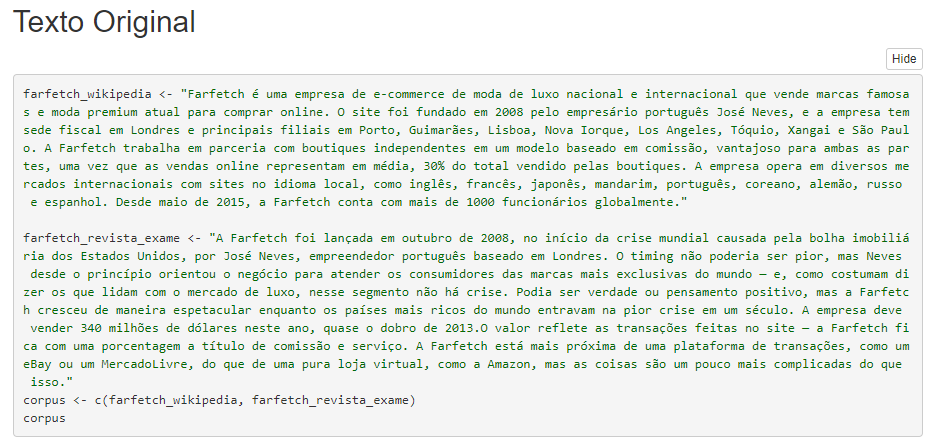
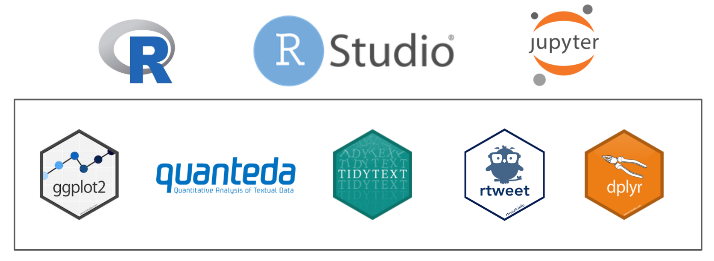
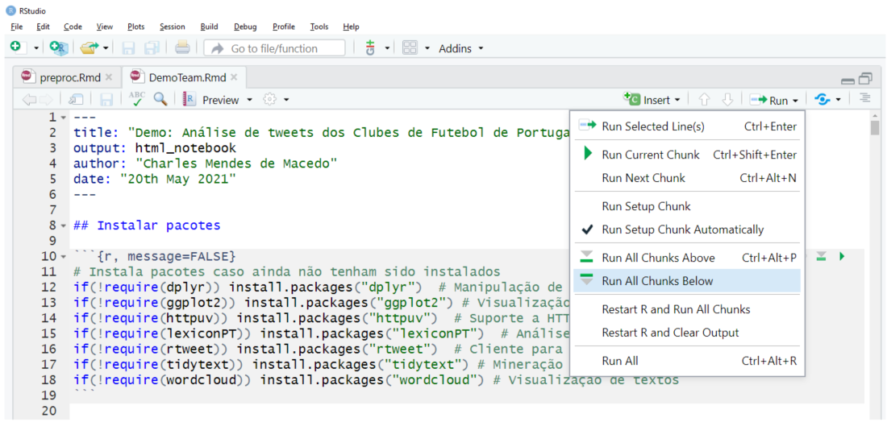

# Text Mining: An introduction

Esta apresentação foi realizada na LIVE do canal Emerging Code no YouTube: [link](https://www.youtube.com/watch?v=oip2dUGKB-s).

O objetivo desta apresentação é mostrar os conceitos básica sobre Text Mining, aplicando-os em Demonstrações e exemplos práticos. 


Os slides desta apresentação estão [aqui](https://github.com/MackMendes/Text-Mining-ConceitosPraticosUsandoR-EmergingCode/blob/master/presentation/TextMining-Conceitos&tecnicas-EmergingCode.pdf).

## Abstract
Nesta apresentação foi mostrado os conceitos básicos de Text Mining aplicados em exemplos de textos reais. A agenda da apresentação foi a seguinte:

* O que é Text Mining?
    * Objetivo 
* Tecnologias
* Demo 1
* Técnicas
    * Tokenização
    * Stop words
    * Bag of words
    * Nuvem de palavras
    * Análise quantitativa de texto
    * N-Gram
* Demo 2

## Demonstrações

### **Pré-processamento**

O objivod desta demonstração foi mostrar as técnicas aplicadas no preparo dos dados (pré-processamento) usando dois textos em Português (BR) sobre a empresa Farfetch.



### **Anáse de tweets dos principais canais de Futebol no Brasil**


Na **Demonstração 2**, foram extraídos 200 tweets dos quatro principais canais de Futebol no Brasil (GE Globo, Sport TV, Fox Sports e ESPN), obtendo então 800 tweets em Português (BR). Todas as técnicas apresentadas foram aplicadas nesta demonstração.


Estes tweets foram extraídos no dia 06/07/2021 às 17h21 (horário Brasil) no Twitter. Depois essas informações foram armazenadas no dataset ***tweets_canais_Brasil_06_07_2021.RData***. 

Para fazer a demonstração, as seguintes tecnologias e pacotes foram usados, com R Jupyter Notebook: 



## Executar a demonstração

Primeiro, instale o RStudio fazendo o download no site [https://www.rstudio.com](https://www.rstudio.com).

Depois, com o RStudio instalado na sua máquina, é necessário atualizar o R (CRAN) para a versão mais recente. E então, execute esse comando no `Console` no RStudio: 

```R
updateR()
```

E siga os passos sugeridos neste [artigo](https://www.r-statistics.com/2015/06/a-step-by-step-screenshots-tutorial-for-upgrading-r-on-windows/).

Agora, com o R atualizado, você tem que atualizar os seguintes pacotes:
* stringr;
* knitr; 
* rmarkdown. 

Executando: 

```R
install.packages("stringr")
install.packages("knitr")
install.packages("rmarkdown")
```

Depois, abra os arquivos das demonstrações (preproc.Rmd e DemoCanalFutebol.Rmd) no RStudio, então faça todos os passos descritos nas demonstrações. Ou execute todos os passos, desta maneira:




## Referências
- [Cliente R para API do Twitter](https://github.com/mkearney/rtweet)
- [Text Mining With R](http://tidytextmining.com/)
